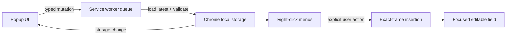

# Architecture

## Runtime layout

- `extension/popup.*`: accessible clip manager UI. It reads snapshots and sends typed mutations; it never overwrites the store directly.
- `extension/background.js`: Manifest V3 service worker. It owns writes, migrations, context menus, and user-triggered insertion.
- `extension/lib/store.js`: pure schema normalization, migration, merge, mutation, and size validation.
- `extension/lib/storage.js`: trusted-context Chrome storage adapter.
- `extension/lib/insert.js`: self-contained functions serialized by `chrome.scripting.executeScript` after a context-menu gesture.
- `extension/lib/text.js`: independently tested selection helpers.

## Data flow



The queue prevents last-writer-wins data loss when a toolbar popup and a dedicated Clipstar window are open at the same time.

## Store schema

The current store key is `clipstar_store_v1`.

```text
Store { version, revision, folders[], snippets[] }
Folder { id, name, parentId, position, createdAt, updatedAt }
Snippet { id, title, folderId, body, position, createdAt, updatedAt }
```

Normalization enforces unique safe IDs, valid references, one subfolder level, bounded counts and strings, valid timestamps, and an 8 MB serialized budget. Cycles are detached to the root; deeper trees are flattened to their root ancestor.

Clip positions are local to their folder (with an empty folder ID representing Standalone). A drag mutation identifies an optional target clip and a before/after placement, then densely renumbers only the affected source and destination lists. The same persisted positions drive both the popup and Chrome's right-click menus.

## Insertion security boundary

Clipstar requests no host patterns and registers no persistent content scripts. Selecting its context-menu item activates Chrome's temporary `activeTab` grant. The service worker executes packaged, reviewable functions in the exact frame reported by Chrome.

The main-world function is needed for framework-controlled fields and ServiceNow's `g_form`. Clip text is already destined for that page field; it is not sent elsewhere. If insertion is not supported, Clipstar attempts a local clipboard write and reports the actual result.
